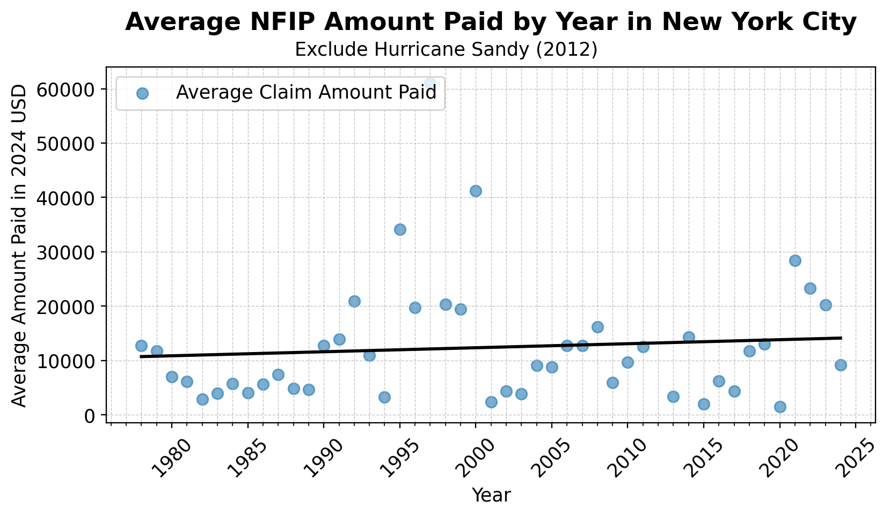
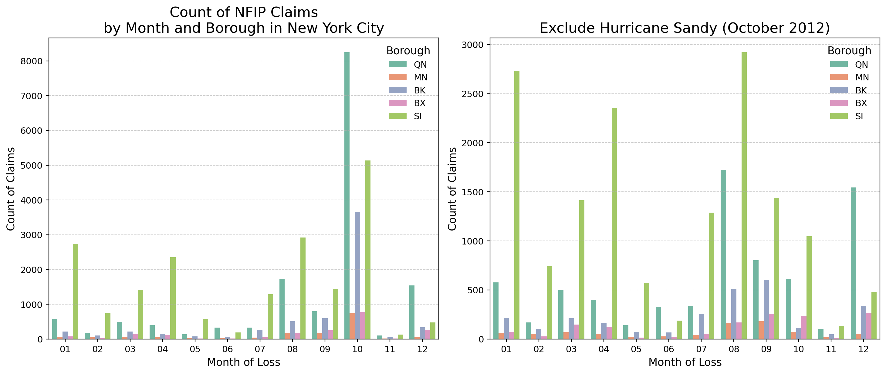
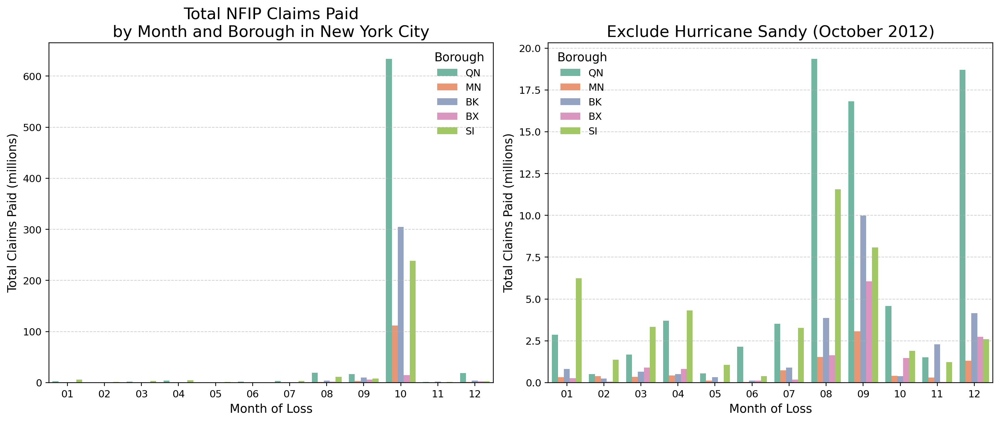
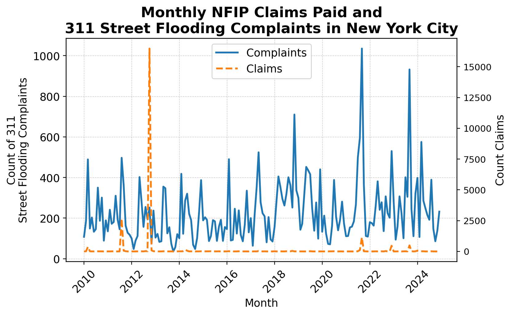
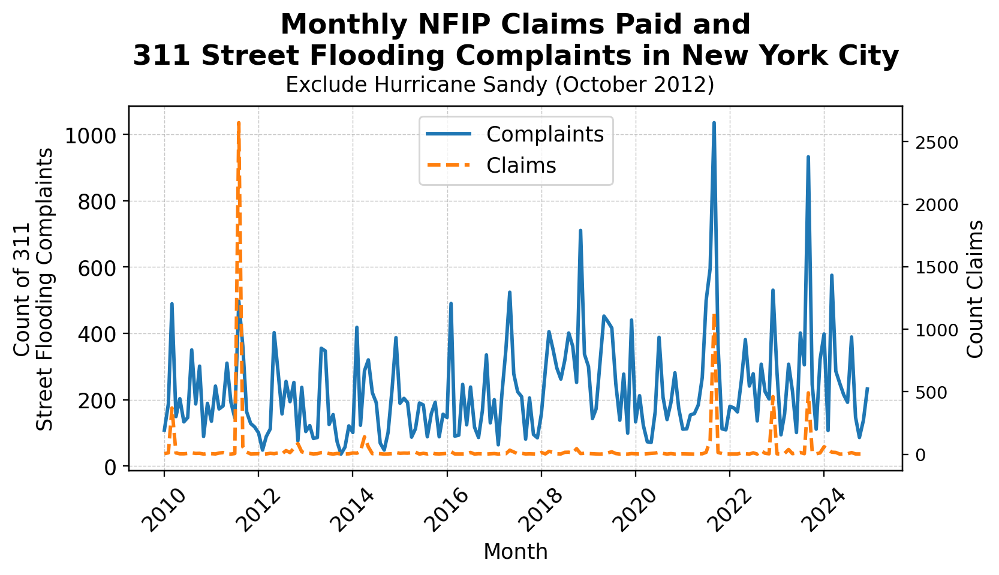

# Analyzing Flood Insurance Claim Trends in New York City: Insights from FEMA's National Flood Insurance Program Data
### NYC School of Data 2025

**Speakers**: Mark Bauer & Tiffany Cousins  
**Event Link**: [Event Details](https://nycsodata25.sched.com/event/1vpPS/analyzing-flood-insurance-claim-trends-in-new-york-city-insights-from-femas-national-flood-insurance-program-data)  
**NYC School of Data Schedule**: [Schedule](https://nycsodata25.sched.com/)  
**NYC Open Data Week 2025**: [Open Data Week Info](https://2025.open-data.nyc/)

Table of Contents
=================

   * [1. Introduction](#1-Introduction)
   * [2. Scripts and Notebooks](#2-Scripts-and-Notebooks)
   * [3. Data](#3-Data)
   * [4. Open Source Applications Used in Project](#4-Open-Source-Applications-Used-in-Project)
   * [5. Further Reading](#5-Further-Reading)
   * [6. Additional Resources](#6-Additional-Resources)
   * [7. Say Hello!](#7-Say-Hello)
   * [8. Appendix](#8-Appendix)

# 1. Introduction

What can we learn about NYC's flood risk and flood insurance claims from FEMA’s National Flood Insurance Program (NFIP) data? How can combining NFIP claims data with datasets like 311 street flooding complaints uncover new insights?

Join Mark Bauer and Tiffany Cousins, two civic-minded data enthusiasts, to explore key trends and relationships in FEMA’s NFIP redacted claims data for NYC, investigating how these trends align with broader flood risk and urban dynamics. We aim to answer the following questions:
- How can we analyze trends in the number and amount of NFIP claims over time?
- What are the most costly flood events, and how do they impact flood risk management?
- How can we map the geographic distribution of claims, while being mindful of the limitations with redacted data?
- What can we learn by integrating NFIP claims data with NYC’s 311 street flooding complaints to identify areas of vulnerability?

The ultimate goal is to equip participants with the skills to use Python, SQL, and DuckDB for analyzing NFIP data, while also providing a deep understanding of NYC's flood risk.

The primary takeaway is how insights from FEMA’s NFIP claims data can drive urban policy decisions, improve flood risk management, and help stakeholders make data-driven choices.

Who should attend? This session is designed for individuals with beginner-level proficiency in data analysis, as well as those interested in flood insurance and urban flood risk. Prior experience with the following will be helpful but is not required:
- Interest in FEMA NFIP data and the OpenFEMA API
- Learning about urban flood risk and data-driven risk analysis
- Basic Python or SQL programming and working with geospatial data

++++++++++++++++++++

**Note**: This analysis uses the Federal Emergency Management Agency’s OpenFEMA API, but is not endorsed by FEMA. The Federal Government or FEMA cannot vouch for the data or analyses derived from these data after the data have been retrieved from the Agency's website(s).

Read more about OpenFEMA's [Terms and Conditions](https://www.fema.gov/about/openfema/terms-conditions).

++++++++++++++++++++

# 2. Scripts and Notebooks

I utilize the OpenFEMA API to programmatically export the Claims and Policies datasets for New York City. This process can be examined in the [nfip_download.py](https://github.com/mebauer/nyc-odw25-nfip/blob/main/nfip_download.py) script. The script takes two arguments: 1) the dataset type (either claims or policies) and 2) a County FIPS code. You can see this in practice in the [download-nfip-data.ipynb](https://github.com/mebauer/nyc-odw25-nfip/blob/main/download-nfip-data.ipynb) notebook.

Feel free to explore and use these resources! A special thank you to OpenFEMA for creating such an excellent API and a nice experience.

### Notebooks
- [download-nfip-data.ipynb](https://github.com/mebauer/nyc-odw25-nfip/blob/main/download-nfip-data.ipynb): How to download NFIP claims and policies datasets using the OpenFEMA API.
- [download-311-flooding.ipynb](https://github.com/mebauer/nyc-odw25-nfip/blob/main/download-311-flooding.ipynb): How to download NYC's 311 dataset filtered for Street Flooding Complaints using the Socrata API and sodapy (the Python client).
- [figures.ipynb](https://github.com/mebauer/nyc-odw25-nfip/blob/main/figures.ipynb): Figures for the analysis.

# 3. Data 

I've programmtically extracted the NFIP Claims [data dictionary](https://github.com/mebauer/nyc-odw25-nfip/blob/main/data-dictionary.csv). You can examine this workflow in the [download-nfip-data.ipynb](https://github.com/mebauer/nyc-odw25-nfip/blob/main/download-nfip-data.ipynb) notebook.

| Dataset | Description |
| :-------- | :---------- |
| [OpenFEMA Dataset: FIMA NFIP Redacted Claims - v2](https://www.fema.gov/openfema-data-page/fima-nfip-redacted-claims-v2) | Congress passed the National Flood Insurance Act (NFIA), 42 U.S.C. 4001 in 1968, creating the National Flood Insurance Program (NFIP) in order to reduce future flood losses through flood hazard identification, floodplain management, and providing insurance protection. This dataset provides details on NFIP claims transactions. It is derived from the NFIP system of record, staged in the NFIP reporting platform and redacted to protect policy holder personally identifiable information. |
| [OpenFEMA Dataset: FIMA NFIP Redacted Policies - v2](https://www.fema.gov/openfema-data-page/fima-nfip-redacted-policies-v2) | Congress passed the National Flood Insurance Act (NFIA), 42 U.S.C. 4001 in 1968, creating the National Flood Insurance Program (NFIP) in order to reduce future flood losses through flood hazard identification, floodplain management, and providing insurance protection. This dataset provides details on NFIP policy transactions. It is derived from the NFIP system of record, staged in the NFIP reporting platform and redacted to protect policy holder personally identifiable information. |

# 4. Open Source Applications Used in Project 

- [OpenFEMA](https://www.fema.gov/about/reports-and-data/openfema): The public’s resource for FEMA program data. Promoting a culture of Open Government and increasing transparency, participation, and collaboration among the Whole Community in support of FEMA's mission to help people before, during, and after disasters. 
- [Python](https://www.python.org/): Python is a programming language that lets you work quickly
and integrate systems more effectively. 
- [DuckDB](https://duckdb.org/): DuckDB is a high-performance analytical database system. It is designed to be fast, reliable, portable, and easy to use. DuckDB provides a rich SQL dialect, with support far beyond basic SQL. 
- [Anaconda](https://www.anaconda.com/): A distribution of the Python and R programming languages for scientific computing (data science, machine learning applications, large-scale data processing, predictive analytics, etc.), that aims to simplify package management and deployment.  
- [Project Jupyter](https://jupyter.org/index.html): Project Jupyter is a non-profit, open-source project, born out of the IPython Project in 2014 as it evolved to support interactive data science and scientific computing across all programming languages.  
    - [Jupyter Notebook](https://jupyter.org/try): The Jupyter Notebook is an open-source web application that allows you to create and share documents that contain live code, equations, visualizations and narrative text.
    
# 5. Further Reading

## Useful Links

### New York City Gov
- FloodHelpNYC: https://floodhelpny.org/

### FEMA
- Flood Insurance: https://www.fema.gov/flood-insurance
- FloodSmart: https://www.floodsmart.gov/

## Research Papers and Academic Articles

- Horn, Diane P., and Baird Webel. 2024. *Introduction to the National Flood Insurance Program (NFIP)*. CRS Report. Library of Congress. https://www.congress.gov/crs-product/R44593.

- Dixon, Lloyd, Noreen Clancy, Benjamin M. Miller, Sue Hoegberg, Michael M. Lewis, Bruce Bender, Samara Ebinger, Mel Hodges, Gayle M. Syck, Caroline Nagy, and Scott R. Choquette. 2017. *The Cost and Affordability of Flood Insurance in New York City: Economic Impacts of Rising Premiums and Policy Options for One- to Four-Family Homes*. Santa Monica, CA: RAND Corporation. https://www.rand.org/pubs/research_reports/RR1776.html. Also available in print form.

- Dixon, Lloyd, Noreen Clancy, Benjamin M. Miller, Sue Hoegberg, Michael M. Lewis, Bruce Bender, Samara Ebinger, Mel Hodges, Gayle M. Syck, Caroline Nagy, and Scott R. Choquette. 2017. *How Affordable Is Flood Insurance in New York City and What Can Be Done to Address Affordability Issues?* Santa Monica, CA: RAND Corporation. https://www.rand.org/pubs/research_briefs/RB9957.html.

- HR&A Advisors, Enterprise Community Partners, Inc., BJH Advisors LLC, Arup, and Willis Group. 2016. *Multifamily Flood Insurance Affordability Study*. HR&A Advisors. https://www.nyc.gov/html/planyc/downloads/pdf/publications/HR-A-Multifamily-Flood-Insurance-Affordability-Study-2016.pdf.

- Dixon, Lloyd, Noreen Clancy, Bruce Bender, Aaron Kofner, David Manheim, and Laura Zakaras. 2013. *Flood Insurance in New York City Following Hurricane Sandy*. Santa Monica, CA: RAND Corporation. https://www.rand.org/pubs/research_reports/RR328.html. Also available in print form.

- Dixon, Lloyd, Noreen Clancy, Bruce Bender, Aaron Kofner, David Manheim, and Laura Zakaras. 2013. *The Rising Cost of Flood Insurance in New York City*. Santa Monica, CA: RAND Corporation. https://www.rand.org/pubs/research_briefs/RB9745.html.

# 6. Additional Resources

- [OpenFEMA](https://www.fema.gov/about/reports-and-data/openfema): The public’s resource for FEMA program data. Promoting a culture of Open Government and increasing transparency, participation, and collaboration among the Whole Community in support of FEMA's mission to help people before, during, and after disasters.  
- [NYC Open Data](https://opendata.cityofnewyork.us/): Open Data is free public data published by New York City agencies and other partners.  

# 7. Say Hello! 
Feel free to reach out for further discussions.

# 8. Appendix

